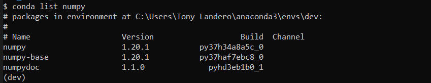
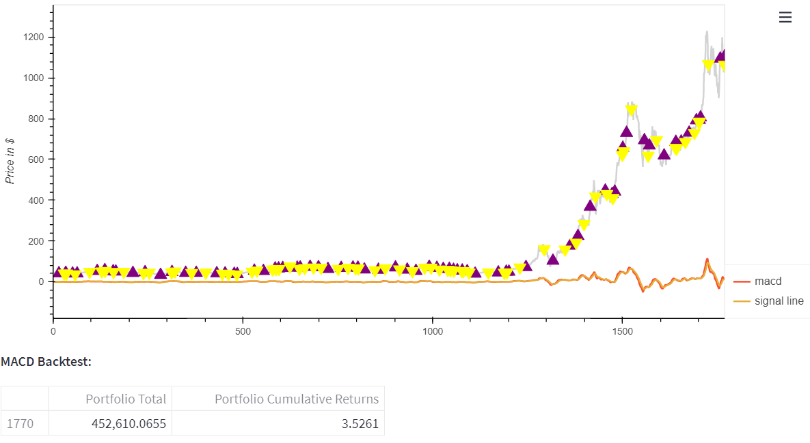

# Stock Forecaster and Strategy Analyzer
Forecast future prices of securities using Facebook Prophet and analyze different trading strategies using backtesting.

---

## Technologies

This project leverages python 3.7 with the following packages:

**[Streamlit Library](https://docs.streamlit.io/)** - Streamlit is an open-source Python library that makes it easy to create and share beautiful, custom web apps for machine learning and data science.<br>

**[datetime.date Library](https://docs.python.org/3/library/datetime.html)** - The datetime module supplies classes for manipulating dates and times. (class datetime.date -
An idealized naive date, assuming the current Gregorian calendar always was, and always will be, in effect. Attributes: year, month, and day.)<br>

**[fbprophet.plot Library](https://facebook.github.io/prophet/docs/quick_start.html)** - Prophet follows the sklearn model API. We create an instance of the Prophet class and then call its fit and predict methods.<br>

**[Plotly Library](https://plotly.github.io/plotly.py-docs/generated/plotly.html)** - Plotly’s Python API allows users to programmatically access Plotly’s server resources.<br>

**[Holoviews Library](https://holoviews.org/index.html)** - HoloViews is an open-source Python library designed to make data analysis and visualization seamless and simple.<br>

**[Matplotlib Library](https://matplotlib.org/)** - Matplotlib is a comprehensive library for creating static, animated, and interactive visualizations in Python.<br>

**[Numpy Library](https://numpy.org/)** - NumPy offers comprehensive mathematical functions, random number generators, linear algebra routines, Fourier transforms, and more.<br>

**[Pandas Library](https://pandas.pydata.org/)** - pandas is a fast, powerful, flexible and easy to use open source data analysis and manipulation tool,
built on top of the Python programming language.<br>

**[hvplot Library](https://hvplot.holoviz.org/)** - A high-level plotting API for the PyData ecosystem built on HoloViews.<br>

**[Pathlib Library](https://pathlib.readthedocs.io/en/pep428/)** - This module offers a set of classes featuring all the common operations on paths in an easy, object-oriented way.<br>

**[yfinance Library](https://pypi.org/project/yfinance/)** - yfinance is **not** affiliated, endorsed, or vetted by Yahoo, Inc. It's an open-source tool that uses Yahoo's publicly available APIs, and is intended for research and educational purposes.<br>

**[OS Library](https://docs.python.org/3/library/os.html)** - This module provides a portable way of using operating system dependent functionality.<br>

**[Backtrader Library](https://www.backtrader.com/)** - backtrader allows you to focus on writing reusable trading strategies, indicators and analyzers instead of having to spend time building infrastructure.<br>

---

## Installation Guide

Before running the application first install the following dependencies:

To install Streamlit, run this command in your git terminal. Make sure you are in the development environment where you would like to install it:

```python
pip install streamlit
```

To verify installation, run the following code in your git terminal:

```python
pip list streamlit
```

Verify installation:


This package installed version 1.3.1

Next, to install DateTime, run this command in your git terminal. Make sure you are in the development environment where you would like to install it:

```python
pip install DateTime
```

The next package to install is FB Prophet. Run this command in your git terminal. Make sure you are in the development environment where you would like to install it:

```python
pip install fbprophet
```

Verify installation:


This package installed version 0.7.1

Next, we need to install the plotly package. Run this command in your git terminal. Make sure you are in the development environment where you would like to install it:

```python
pip install plotly
```

Verify installation by running the following command in your terminal:

```python
conda list plotly
```


The next package to install is holoviews. Run this command in your git terminal. Make sure you are in the development environment where you would like to install it:

```python
pip install holoviews
```

Verify installation by running the following command in your terminal:

```python
conda list holoviews
```


The next package to install is matplotlib. Run this command in your git terminal. Make sure you are in the development environment where you would like to install it:

```python
pip install matplotlib
```

Verify installation by running the following command in your terminal:

```python
conda list matplotlib
```


The next package to install is numpy. Run this command in your git terminal. Make sure you are in the development environment where you would like to install it:

```python
pip install numpy
```

Verify installation by running the following command in your terminal:

```python
conda list numpy
```



The next package to install is pandas. Run this command in your git terminal. Make sure you are in the development environment where you would like to install it:

```python
pip install pandas
```

Verify installation by running the following command in your terminal:

```python
conda list pandas
```


The next package to install is hvplot. Run this command in your git terminal. Make sure you are in the development environment where you would like to install it:

```python
pip install hvplot
```

Verify installation by running the following command in your terminal:

```python
conda list hvplot
```


The next package to install is pathlib. Run this command in your git terminal. Make sure you are in the development environment where you would like to install it:

```python
pip install pathlib
```

Verify installation by running the following command in your terminal:

```python
conda list pathlib
```


The next package to install is yfinance. Run this command in your git terminal. Make sure you are in the development environment where you would like to install it:

```python
pip install yfinance
```

Verify installation by running the following command in your terminal:

```python
conda list yfinance
```


The last package to install is backtrader. Run this command in your git terminal. Make sure you are in the development environment where you would like to install it:

```python
pip install backtrader
```

Verify installation by running the following command in your terminal:

```python
conda list backtrader
```


---

## Usage

To use the 'Stock Forecaster and Strategy Analyzer' application, simply clone the repository and run **Streamlit.py** in your terminal. 

You can also run the application by clicking on the following link:

**[Streamlit.py](https://share.streamlit.io/speedsmach5/market_tools/main/Streamlit.py)**

Step 1: Select the ticker you want to forecast and analyze:


For this explanation, we will be using Tesla (Ticker: TSLA)

Step 2: Select the strategies you want to analyze:


For this example, we will use all 4 strategies. (DMAC, MACD, EMA/SMA Crossover, Buy the Dip)

Step 3: Select the number of prediction days you want to forecast:


For this example, we will predict 5 days.

Step 4: Run Analysis:


Step 5: Summary of parameters:


This is your opportunity to verify the options you made from the dropdown menus.

Step 6: Review the last 5 closes for the chosen ticker:


As you can see from the dataframe. The last closing price for TSLA was on Jan. 12, 2022, and it was for the amount $1,106.22

Step 7: Review forecasting dataframe for predicted closing prices:


The yhat column states what we expect the closing price for TSLA to be on March 3, 2022. Notice that the predicted closing price is $1,086.40. This means that we expect TSLA to close about $20/share less than the closing price today. We expect TSLA to decline from its current value by March 3. This will be a great time to **short** this stock. 

Step 8: Review chart for the forecasted prices:


In this chart, the solid blue line represents the yhat column, or the predicted closes for TSLA. The black dots represent the **actual** closing prices for the underlying security. 


If we zoom in to the end of the predictions, we can see where we expect TSLA to be trading for the highlighted timeframe. 

Step 9: Review the separate component charts:


As we can see from the charts, TSLA stock really spiked during and after 2020. Historically, we see that TSLA stock tends to increase during the weekend, and it slides beginning on Mondays until it hits bottom on Fridays. This might give us a great strategy to buy on Friday before market close and sell on Monday at market open. In other words, buy low and sell high. The monthly component chart is very similar. We can observe that historically, TSLA seems to be at its highest valuations during January and then begins its descent. It tends to bottom out early in May before starting its rebound around October. It then rises until January, where it tops out, before beginning another slide down. We can buy TSLA in early March, when it is historically less valuable, and sell it in January when the stock historically hits its yearly peak. 

Step 10: Analyze the Double Moving Average Crossover (DMAC) Strategy:


First, we see the chart showing the short sma, long sma, and closing prices, along with the entry/exit point signals. Any time the short sma crosses the long sma it triggers a signal. If the short sma crosses the long sma in an upward direction, we can expect closing prices to start trending higher. Conversely, if the short sma crosses the long sma in a downward direction, we can predict the closing prices to start trending lower. 

We backtested our strategy with a starting portfolio total of $100,000 and a stake size of 500 shares. This means that every time a signal is triggered we'll either buy or sell 500 shares of TSLA.

The results are unbelievable. With the DMAC strategy if we would applied it starting in 2015, your portfolio total would be $636,899.00 today. That is a gain of 536%. 

Step 11: Analyze the Moving Average Convergence/Divergence Strategy:



We backtested our strategy with a starting portfolio total of $100,000 and a stake size of 500 shares. This means that every time a signal is triggered we'll either buy or sell 500 shares of TSLA.

If we would have applied this strategy starting in 2015, your portfolio would be worth $452,610.07. That is a return of 352%. Although this strategy resulted in great returns, they still pale in comparison with the DMAC strategy.

Step 12: Analyze the EMA/SMA Crossover Strategy:


We backtested our strategy with a starting portfolio total of $100,000 and a stake size of 500 shares. This means that every time a signal is triggered we'll either buy or sell 500 shares of TSLA.

If we would have applied this strategy starting in 2015, your portfolio would be worth $125,854. That is a return of 25%. Over the same 6 year period, this strategy failed to produce the same results that were produced with the DMAC, and MACD strategies. The DMAC Strategy still has the advantage. 

Step 13: Analyze the Buy the Dip Strategy:


We backtested our strategy with a starting portfolio total of $100,000 and a stake size of 500 shares. This means that every time a signal is triggered we'll either buy or sell 500 shares of TSLA.

If we would have applied this strategy starting in 2015, your portfolio would be worth $245,297. This is a return of 145% from your original investment. You would be happy with this return overall, however, it still does not compare to the returns generated by the DMAC Strategy. 

For Tesla (TSLA), The Double Moving Average Crossover seems to be the best strategy to use if you want to trade Tesla. 

However, you need to run the program for each different ticker you want to evaluate. The reason for this is that some strategies work very well for some stocks, but not so well for others. We need to continue looking at algorithms until we find the one we want to deploy on certain stocks.

---

## Contributors

**Conceptual Idea:** Quentin Reynolds<br>
**Lead Integration Engineer:** Jacob Rougeau<br>
**Lead Sentiment Analyst:** Emmanuel George<br>
**Lead Strategy Analyst:** Tony Landero

---

## License

MIT